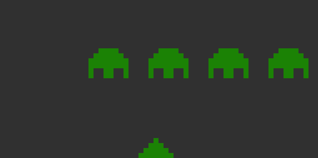

<p align="center">

<h2 align="center">chipgenics</h2>
</p>

> Quarantine day 22: _"I think I'm gonna write a hardware emulator"_

[](https://travis-ci.org/adrianovalente/chipgenics)
[]()
[](https://coveralls.io/github/adrianovalente/chipgenics?branch=master)

**chipgenics** is my homemade implementation of a CHIP-8 Virtual Machine running 100% on Javascript. It can be used as the core code for web, mobile or even Node.JS applications. A live demo is available on **[chipgenics.site](http://chipgenics.site)**.

### What is CHIP-8?
CHIP-8 is an interpreted programming language developed by [Joseph Weisbecker](https://en.wikipedia.org/wiki/Joseph_Weisbecker) during the 1970's. A lot of famous games have their version for CHIP-8, such as Space Invaders, Tetris and others.

<p align="center">

</p>
<p align="center">Screenshot of Space Invaders as developed by David Winter running on <b>chipgenics</b></p>

### The architecture
CHIP-8 was designed to have a very simple implementation. Its CPU had 16 one-byte registers, apart from a special one used to store memory addresses. Most implementations had a memory of 4096 positions. The processor also had a stack which allowed up to eight recursive subroutine calls. This project implements the CHIP-8 in its original architecture, component by component.

### Instruction Set
CHIP-8 had a instruction set composed by 48 instructions, including arithmetic and boolean operations, logical jumps, subroutines and a special instruction to draw on the screen. The complete CHIP-8 instruction set can be found [here](http://mattmik.com/files/chip8/mastering/chip8.html).

### Stop talking, show me the code
After cloning this project and installing the dependencies, you can use the emulator core code requiring the main file under `src/chip8`.

``` javascript
const Chip8 = require('src/chip8')

const program = [
  0x00e0 // Clears the screen
  0x6102, // v1 = 02
  0x6202, // v2 = 02
  0xa00a, // sets I to 0x000a (position of the sprite for `2`)

  0xd125  // draws the number "2" on the screen
]

const chip8 = new Chip8({
  memory: {
    program
  }
}).start()

console.log(chip8.display.render())
// => this will log the rendered screen on the output

```

Alternatively you can also load a program directly from a ROM using the `loadProgram` method from the `Chip8.Memory` class.

### Known issues
- The sound timer is still not implemented.
- There is an issue in ~at least~ one implemented instruction. You can tell it by playing `Space Invaders` firing a bullet, you will see that some unexpected things happen then. I will totally pay you a beer if you can find it :)
